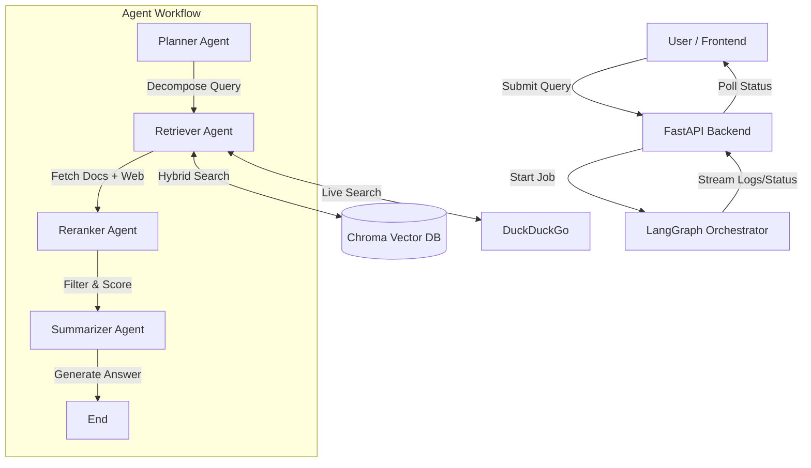

# MEKA: Multi-Agent Expert Knowledge Assistant

[](LICENSE)
[](https://www.python.org/downloads/)
[](https://fastapi.tiangolo.com/)

A local, privacy-focused knowledge assistant designed to ingest heterogeneous documents and answer complex queries using a multi-agent architecture. MEKA runs entirely on CPU using open-source models with zero API costs.

---

## 📋 Table of Contents

- [Overview](#overview)
- [System Architecture](#system-architecture)
- [Agent Workflow](#agent-workflow)
- [Technology Stack](#technology-stack)
- [System Requirements](#system-requirements)
- [Installation](#installation)
- [Usage](#usage)
- [API Documentation](#api-documentation)
- [Development](#development)
- [Trade-offs and Limitations](#trade-offs-and-limitations)
- [Testing Approach](#testing-approach)
- [AI Assistance Declaration](#ai-assistance-declaration)
- [License](#license)

---

## 🎯 Overview

MEKA (Multi-Agent Expert Knowledge Assistant) is designed to process and query heterogeneous documents including:
- PDF files
- CSV datasets
- DOCX documents
- JSON data

Unlike simple RAG (Retrieval-Augmented Generation) systems, MEKA employs specialized agents that plan, retrieve, rerank, and summarize information to provide evidence-backed answers.

### Key Features

- **🔒 Privacy-First:** Runs entirely locally with no data leaving your machine
- **💰 Zero Cost:** No API fees - uses open-source models
- **🖥️ CPU-Only:** Optimized for standard hardware without GPU requirements
- **🤖 Multi-Agent Architecture:** Specialized agents for planning, retrieval, reranking, and summarization
- **🔍 Hybrid Search:** Combines semantic (vector) and keyword (BM25) search
- **📊 Evidence-Based:** Answers include source citations

---

## 🏗️ System Architecture

The system follows a loop-based workflow managed by a central LangGraph orchestrator:



---

## 🤖 Agent Workflow

### 1. Planner Agent
- **Input:** Complex user query (e.g., "Compare X and Y")
- **Action:** Breaks the query into logical steps
- **Output:** List of search tasks

### 2. Retriever Agent
- **Input:** Search tasks from planner
- **Action:** 
  - Performs hybrid retrieval (Vector DB + BM25 keyword search)
  - Searches DuckDuckGo for up-to-date web context
- **Output:** Collection of potentially relevant document chunks

### 3. Reranker Agent
- **Input:** Retrieved document chunks
- **Action:** Uses Cross-Encoder to assign relevance scores (0-100%)
- **Output:** Top 3-5 highly relevant pieces of evidence

### 4. Summarizer Agent
- **Input:** Original question, plan, and filtered evidence
- **Action:** Synthesizes final answer with source citations
- **Output:** Structured response with references

---

## 🛠️ Technology Stack

| Component | Technology | Rationale |
|-----------|-----------|-----------|
| **LLM** | Qwen 2.5 (3B) | Efficient CPU performance; outperforms Llama-3-8B while being 60% smaller |
| **Orchestration** | LangGraph | State management for multi-agent workflows |
| **Vector Database** | ChromaDB | Open-source, local, fast embedding handling |
| **Hybrid Search** | Chroma + BM25 | Combines semantic and exact-match capabilities |
| **Reranking** | Cross-Encoder | Precise relevance scoring to reduce hallucinations |
| **Embeddings** | all-MiniLM-L6-v2 | Lightweight, standard model for English text |
| **Reranker Model** | ms-marco (SentenceTransformers) | Optimized for passage ranking |
| **Backend** | FastAPI | Modern, fast, async Python web framework |
| **Model Serving** | Ollama | Local LLM serving with OpenAI-compatible API |

---

## 💻 System Requirements

### Minimum Requirements
- **RAM:** 8GB (16GB recommended)
- **CPU:** Modern CPU with AVX2 support (Intel i5 8th gen+ or equivalent)
- **Storage:** 5GB free space for models
- **OS:** Windows, Linux, or macOS

### Performance Note
⚠️ This project runs a **3 Billion Parameter LLM** and **BERT-based Cross-Encoder** entirely on CPU. Performance varies by hardware:
- **Mid-range systems:** 5-15 seconds per query
- **Lower-end systems:** 15-30 seconds per query

---

## 📦 Installation

### 1. Install Ollama
Download and install from [ollama.com](https://ollama.com), then pull the required model:

```bash
ollama pull qwen2.5:3b
```

### 2. Clone Repository
```bash
git clone https://github.com/Bhargavsuryawanshi/MEKA.git
cd MEKA
```

### 3. Install Python Dependencies
```bash
pip install -r requirements.txt
```

### 4. Add Your Documents
Place your documents (PDF, CSV, DOCX, JSON) in the `data/` folder:

```
data/
├── document1.pdf
├── dataset.csv
└── report.docx
```

### 5. Ingest Documents
```bash
python -m backend.ingest
```

---

## 🚀 Usage

### Start the Backend
```bash
uvicorn backend.server:app --reload
```

The API will be available at `http://localhost:8000`

### Access the Frontend
Open `frontend/index.html` in your web browser

### Example Queries
- "Summarize the audit report"
- "Compare the security policies in documents X and Y"
- "What are the key findings from the financial data?"

---

## 📡 API Documentation

### Submit Query
**Endpoint:** `POST /query`

Submit a new question to the agent system.

**Request Body:**
```json
{
  "query": "Summarize the audit report."
}
```

**Response:**
```json
{
  "job_id": "12345-uuid"
}
```

### Check Status
**Endpoint:** `GET /status/{job_id}`

Check the progress of agent processing.

**Response (Running):**
```json
{
  "status": "running",
  "logs": ["Planner finished...", "Retriever searching..."]
}
```

**Response (Completed):**
```json
{
  "status": "completed",
  "answer": "The audit report found...",
  "context": ["Source text 1...", "Source text 2..."],
  "plan": ["1. Search logs", "2. Summarize findings"]
}
```

---

## 🔧 Development

### Development Environment
- **IDE:** VS Code (recommended)
  - Lightweight with excellent Python extension support
  - Integrated terminal for managing backend and database
- **Platform:** Cross-platform (Windows/Linux/macOS)

### Project Structure
```
meka/
├── backend/
│   ├── server.py          # FastAPI application
│   ├── ingest.py          # Document ingestion
│   ├── agents/            # Agent implementations
│   └── retrieval.py       # Search logic
├── frontend/
│   └── index.html         # Web interface
├── data/                  # Document storage
└── requirements.txt       # Python dependencies
```

---

## ⚖️ Trade-offs and Limitations

### Latency
- CPU-based processing results in 5-15 second response times (vs. sub-second with cloud GPUs)
- Reranking and generation are the primary bottlenecks

### Context Window
- 3B model has smaller context window than GPT-4
- Long documents require careful chunking to avoid information loss

### Session Persistence
- Chat history stored in RAM (in-memory)
- Server restart results in history loss
- Implemented for simplicity in demo environment

---

## 🧪 Testing Approach

### Unit Testing (Ingestion)
- Verified correct parsing of PDF, CSV, and DOCX files
- Validated text chunking using print statements in `ingest.py`

### Component Testing (Retrieval)
- Manually tested `retrieval.py` script
- Verified semantic and keyword search accuracy

### End-to-End Testing
- Used frontend UI to test multi-document queries
- Validated agent coordination and answer quality

---

## 🤝 AI Assistance Declaration

### AI-Generated Components
- FastAPI boilerplate and route setup
- HTML/CSS styling for frontend interface

### Manual Development
- Multi-agent architecture design
- Reranking logic implementation
- Hybrid search system
- Core business logic and workflow orchestration

All AI-generated code was reviewed, tested, and modified to meet MEKA's specific requirements.

---

## 📄 License

This project is licensed under the MIT License - see the [LICENSE](LICENSE) file for details.

